# Doing Kubernetes CI/CD right with ArgoCD, Kustomize and Github Actions

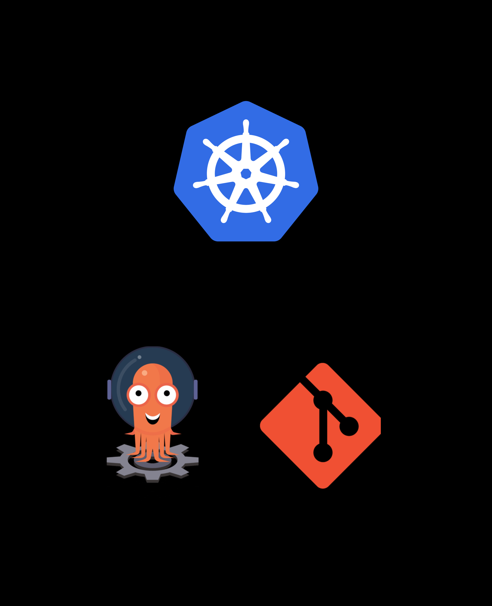

## Why we need CI/CD?
**CI/CD** reduces the gap between your system infrastructure and your development process thus allowing new features to be tested, deployed and delivered much more quickly. CI/CD is a must because:
- Manual deployments can be error prone
- Allow graceful changes like `Blue-Green Deployments` and `Canary Testing`

## CI/CD and Kubernetes
For deploying cloud-native applications safely and efficiently on Kubernetes, we need something different from traditional **CI/CD pipelines**. It should follow the same declarative way used by `k8s` to manage applications:
- Injecting Kubernetes objects through a declarative document as YAML or JSON.
- Kubernetes Operators processing endlessly, evaluating the difference between the submitted objects and their real state in the cluster.

## Why GitOps?
GitOps is especially suited to deploy cloud-native applications on Kubernetes following the above methodology while retaining it's underlying philosophy:
- Use Git repo as single source of truth
- changes are triggered with a Git commit
- When the state of repo changes, same changes are enforced inside the cluster.

## Our GitOps flow

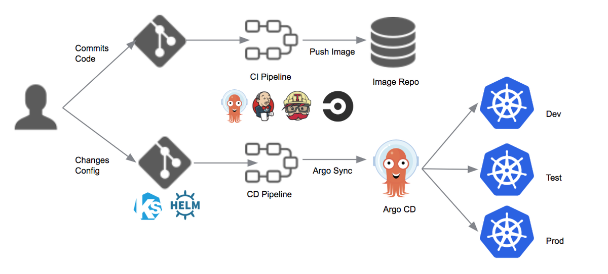

**Tools**<br>
- **ArgoCD** - it lives inside our cluster and is responsible for deploying changes commited to repo.
- **Github Actions** - it is responsible for building & pushing image to docker hub, and commit the latest image tag back to infra repo.
- **Kustomize** - it describes our application infrastructure and specification.

## Let's start with a single node k8s cluster
I am using [microk8s](https://microk8s.io/) as it's lightweight and super easy to install.<br>
[*download-docs*](https://microk8s.io/docs)
```bash
# install the binary with snap
sudo snap install microk8s --classic --channel=1.19

# add your current user to the group and gain access to the .kube caching directory
sudo usermod -a -G microk8s $USER
sudo chown -f -R $USER ~/.kube

# MicroK8s uses a namespaced kubectl command to prevent conflicts with any existing installs of kubectl
# to use kubectl add alias to ~/.bash_aliases
alias kubectl='microk8s kubectl'

# MicroK8s uses the minimum of components for a pure, lightweight Kubernetes
# it is recommended to add DNS management to facilitate communication between services
microk8s enable dns
```
To verify your installation, run the following commands

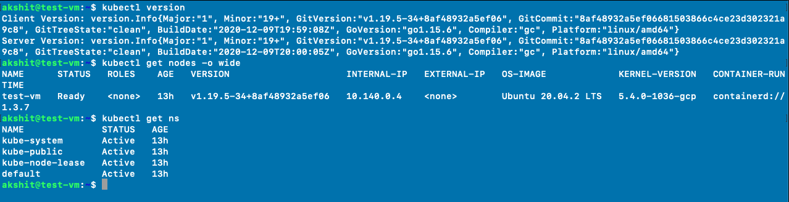

## Our application
I'll be using a simple golang application with a `GET /health` route.

```go
package main

import (
	"fmt"
	"log"
	"net/http"
	"os"

	"github.com/gin-gonic/gin"
)

var port string

func main() {
	port = os.Getenv("PORT")
	if port == "" {
		port = "3000"
	}

	router := gin.Default()

	router.GET("/health", health)

	log.Fatal(router.Run(fmt.Sprintf("0.0.0.0:%s", port)))
}

func health(c *gin.Context) {
	c.JSON(http.StatusOK, gin.H{
		"success": "true",
		"message": "api is working",
	})
}
```

The associated Dockerfile is quite simple, building the application then running it in a Linux container

```Dockerfile
FROM golang:alpine as builder

ENV GO111MODULE=on \
    CGO_ENABLED=0 \
    GOOS=linux \
    GOARCH=amd64

WORKDIR /builder
COPY . .
RUN go mod download
RUN go build -o app main.go

FROM scratch

COPY --from=builder /builder/app .
ENTRYPOINT [ "./app" ]
EXPOSE 3000
```

Our **CI pipeline** has two jobs:
- One for running tests, building and pushing the container on Dockerhub(with `Github SHA` as image tag).
- The second one will edit the `Kustomize` patch to bump the expected container tag to the new Docker image and then commit these changes.

```yml
name: gitops-CI

on: 
  # workflow dispatch requires manual trigger
  workflow_dispatch:

jobs:
  build:
    name: build
    runs-on: ubuntu-latest

    steps:
      - name: check out code
        uses: actions/checkout@v2

      - name: build and push docker image
        uses: docker/build-push-action@v1.1.0
        with: 
          username: ${{ secrets.USERNAME }}
          password: ${{ secrets.PASSWORD }}
          repository: ${{ secrets.USERNAME }}/argo-app
          tags: ${{ github.sha }}, latest
          path: ./app

  deploy:
    name: Deploy
    runs-on: ubuntu-latest
    needs: build

    steps:
    - name: Check out code
      uses: actions/checkout@v2

    - name: Setup Kustomize
      uses: imranismail/setup-kustomize@v1
      with:
        kustomize-version: "3.6.1"

    - name: Update Kubernetes resources
      env:
        DOCKER_USERNAME: ${{ secrets.USERNAME }}
      run: |
        cd infra
        kustomize edit set image argo-app=$DOCKER_USERNAME/argo-app:$GITHUB_SHA
        cat kustomization.yml
        
    - name: Commit files
      run: |
        git config --local user.email "action@github.com"
        git config --local user.name "GitHub Action"
        git commit -am "rolling image to tag $GITHUB_SHA"

    - name: Push changes
      uses: ad-m/github-push-action@master
      with:
        github_token: ${{ secrets.GITHUB_TOKEN }}
```

Configure the repository secrets, commit your code to Github and trigger the above action. If your action passes, you'll have a image pushed to Docker hub(with GITHUB SHA as image tag) and commit to your repository by Github action like this

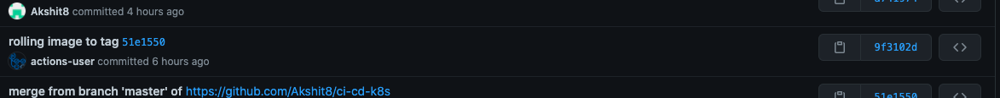

## Let's deploy our app
Before setting ArgoCD let us first deploy our app inside the cluster to make sure everything works.<br>
Before proceeding do check the [infra](https://github.com/Akshit8/ci-cd-k8s/tree/master/infra) to make sure you have required set of `k8s components`.
```bash
# create a new namespace
kubectl create ns argo-app

# apply the changes
kubectl -n argo-app kustomize ci-cd-k8s/infra/ | kubectl -n argo-app apply -f -

# check all components are running
kubectl get all -n argo-app

# port forward to access health router
kubectl port-forward --address 0.0.0.0 service/argo-app -n argo-app 3000:3000
```

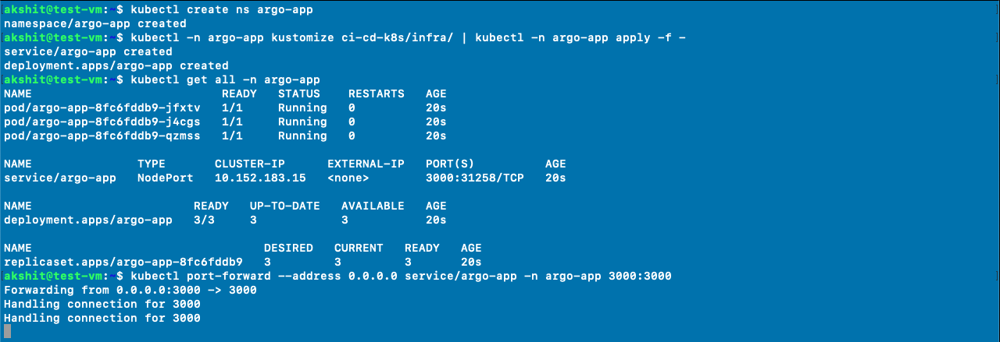

After **port forwarding**, open `localhost:3000/health` to verify whether everything is working.

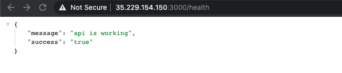

## Setting up ArgoCD
Check [argocd-getting-started](https://argoproj.github.io/argo-cd/getting_started/) here.<br><br>
I have copied install.yaml from [here](https://raw.githubusercontent.com/argoproj/argo-cd/stable/manifests/install.yaml) and checked into git so that I am able to install same version of Argo in future, if required.
```bash
kubectl create ns argo

kubectl -n argo apply -f ci-cd-k8s/argo/install.yml  

kubectl port-forward --address 0.0.0.0 service/argocd-server -n argo 3001:443
```
To verify your installation run the following command. Make sure all the listed components are in **healthy** condition.

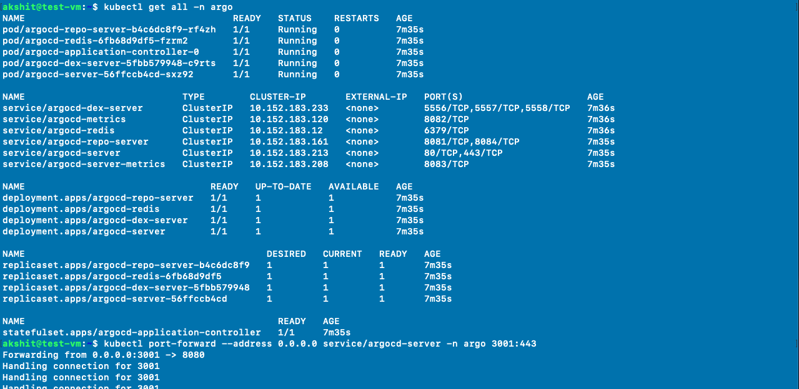

After **port forwarding**, open `localhost:3001` and login with `admin` as *username* and `argocd-server podname` as *password*.

## Connecting Git repo with Argocd
Once you are able to access the web ui, let's now connect our git repository to argo cd.<br><br>
Generate a ssh key-pair using following command
```bash
ssh-keygen
```
Before making any change to Argo let's first add the public ssh key inside our Github repo. Open `repo-settings` > `deploy-key` and add the public key by clicking on **Add Deploy Key**

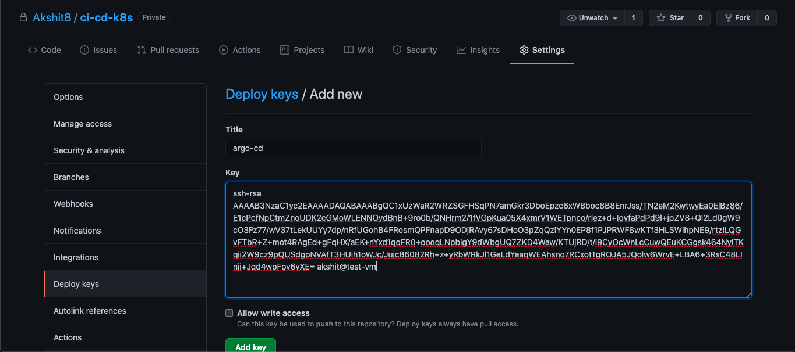

Inside web ui navigate to `settings`>`repositories` and click on **CONNECT REPO USING SSH** option. Add the following details
```
name: argo-app
repository: git@github.com:/Akshit8/ci-cd-k8s
```
After pasting your private ssh key, click on **connect**. If the connection is successful you'll see something similar to below

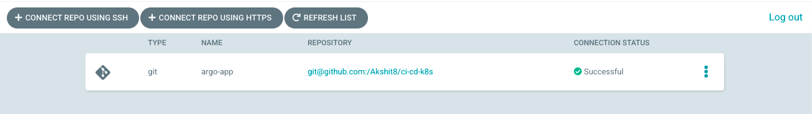

## Creating CD pipeline on ArgoCD
ArgoCD must be configured to observe our Git repository. This is done simply by creating an application, where we tell Argo how to deploy our application to cluster. On `Applications` page click on `New App` to start creating a new application. 

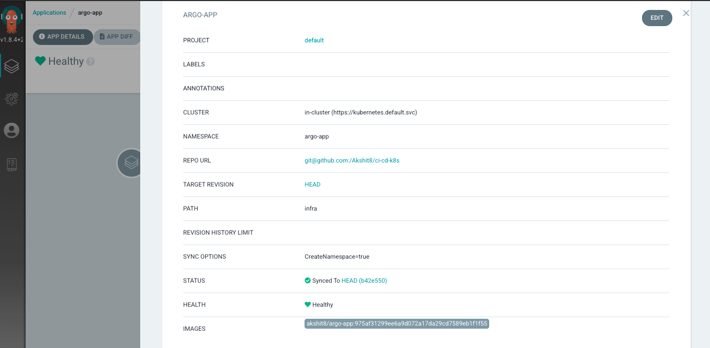

**Note:** After adding `infra` as the path field, argo would automatically sense that we are using Kustomization(since our infra folder have a `kustomization.yml` file)

## GitOps Magic
Note that at the end of the GitHub Actions pipeline, we don’t run any imperative command to deploy our application, we just changed our container version using Kustomize and auto-pushed these changes into our repository.<br><br>
If you do any code change, the pipeline is triggered and a new Docker image is pushed, the container version is updated and ArgoCD should catch the change.<br><br>
Let us test our CI/CD pipeline by adding one more endpoint to our Go application, and run the Github action after commiting the code.

```go
router.GET("/argo", argo)

func argo(c *gin.Context) {
	c.JSON(http.StatusOK, gin.H{
		"success": "true",
		"message": "our CI/CD pipeline is working",
	})
}
```

Once the action is successfully done, the changes would be reflected on ArgoCD web ui

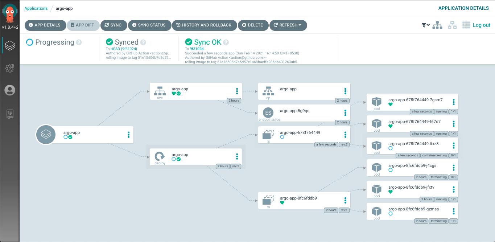

Note that ArgoCD is gracefully removing old container while simultaneously adding the new ones. After the new deploy is done open `localhost:3000/argo` (do make sure port-forwarding is applied) to check newly the newly added endpoint

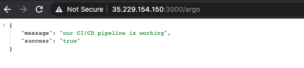

## A final word
- If you have made till here, congrats! as you now have a production-ready gitOps style cloud-native CI/CD pipeline at your disposal.
- You may use this as a foundatinal template to build our own superb CI/CD pipelines.
- The above pipeline is so modular that you easily swap any component from it and use something you like, for e.g argo can be replaced with flux, we can use helm instead of kustomize etc.
- I personally used ArgoCD because it can connect to multiple repos and it comes with an awesome web ui. Also it'smart to enforce a change to cluster only if it's needed.
- If you are using a public repo you can skip **Connecting Git repo with Argocd** part
- If you need to pull image from a private registry you just need to [configure image pull secret for it](https://kubernetes.io/docs/tasks/configure-pod-container/pull-image-private-registry/)

## Author
**Akshit Sadana <akshitsadana@gmail.com>**

- Github: [@Akshit8](https://github.com/Akshit8)
- LinkedIn: [@akshitsadana](https://www.linkedin.com/in/akshit-sadana-b051ab121/)

## License
Licensed under the MIT License


